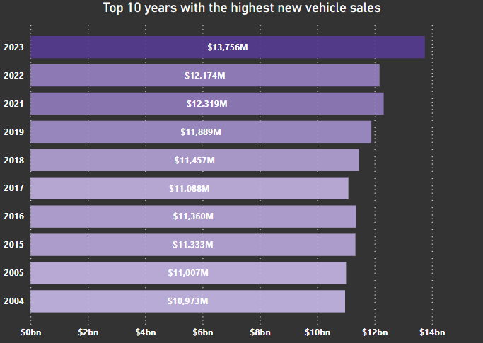
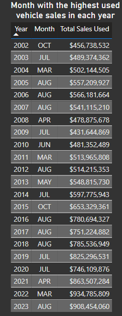
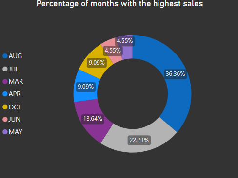
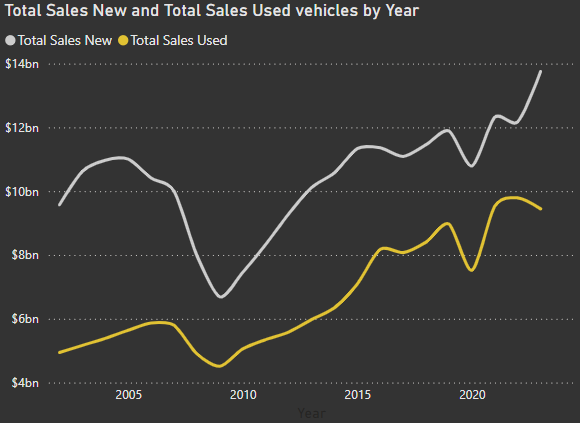
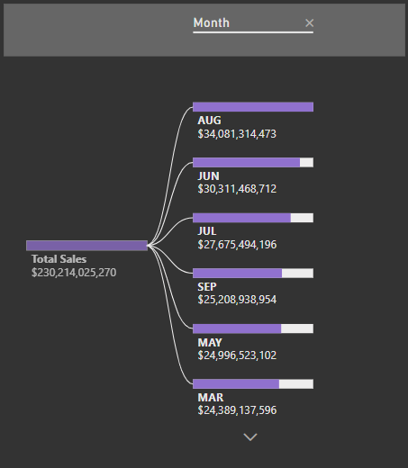
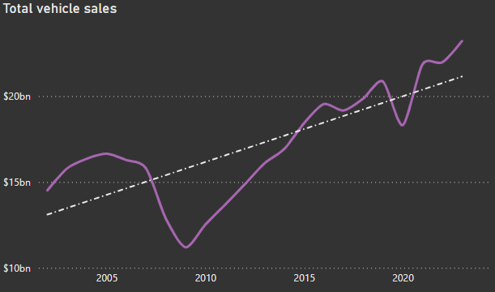

# Vehicle Sales Analysis

The market for new and used vehicle sales has gone through a roller coaster of situations in this new century, including economic recessions, rising fuel prices, and even a pandemic. In the following analysis of vehicle sales📈, we will explore certain questions about this market using SQL 🔍 and Power BI 📊.

Data sourced from Kaggle (dataset: Vehicle_Sales_Count by Year 2002-2023).

### The questions I wanted to answer with SQL Queries were:

1. Which year had the highest total of new vehicle sales, and what was the total that year?
2. Which month had the highest used vehicle sales in each year?
3. How were the new and used vehicle sales throughout each year?
4. Which months had sales higher than their averages over each year?
5. How has the evolution of the vehicle sales market been from 2002 to 2023?

# Tools I used

These are the tools were used in this analysis:

- **SQL:** It is the central tool for analysis, where DML (Data Manipulation Language) queries were used to query the database. DDL (Data Definition Language) was also generated to create the database, tables, and constraints.
- **Power BI:** This tool was used to create visualizations that allowed for deeper and more dynamic analysis, helping to uncover valuable insights about the vehicle market.
- **PostgreSQL:** This was the chosen database management system for database creation, and its versatility enabled a strong connection with Visual Studio Code.
- **Visual Studio Code:** This is the most widely used code editor currently, and due to its high customizability, it was selected as the tool for writing queries.
- **Git & GitHub** These tools were used in the project as version control applications, allowing for both local and remote storage and management of the project.

# Analysis

To analyze the new and used vehicle market during the period from 2002 to 2023, we aim to answer certain questions and understand descriptively whether some changes were caused by external factors such as the 2006 economic crisis and the 2020 pandemic. To achieve this, we primarily used SQL to run the relevant queries for each of the posed inquiries, and finally, we will validate whether the external factors mentioned have influenced vehicle sales.

### 1. Which year had the highest total of new vehicle sales, and what was the total that year?

The question is aimed at identifying the year with the highest new vehicle sales, which, in theory, should be the last year of sales at nominal value, since we are not conducting an analysis based on real value (excluding inflation).

```sql
WITH fvs AS (
    SELECT year,
        SUM(total_sales_new)::money AS total_new_sales_by_year
    FROM fact_vehicle_sales
    GROUP BY year
)

SELECT *
FROM fvs
WHERE total_new_sales_by_year = (
        SELECT MAX(total_new_sales_by_year)
        FROM fvs
    )
```

As expected, the year with the highest sales was 2023, with $13.756 billion. This will be shown in the following graph, where a progressive increase in new vehicle sales will be evident



_Graph showing the years with the highest new vehicle sales during the period from 2002 to 2023. The year 2023 is shown as the year with the highest sales, with a total of $13,755,763,434, approximately 14 billion_

### 2. Which month had the highest used vehicle sales in each year?

In this question, we aim to determine which months had the highest sales in each year. The goal is to identify the months with the highest sales and see if these are recurring during certain periods. To achieve this, a correlated subquery is performed, filtering the inner table for each element in the outer table to find the highest sales.

```sql
SELECT year,
    month,
    total_sales_used::money
FROM fact_vehicle_sales fact_outer
WHERE total_sales_used = (
        SELECT MAX(total_sales_used)
        FROM fact_vehicle_sales fact_inner
        WHERE fact_outer.year = fact_inner.year
    )
```

The following charts, both the table and the donut chart, show that some months consistently have the highest sales in their respective years. Notably, summer months like August and July together account for 59% of all months with the highest sales.



_A table that shows the months with the highest sales for each year. As can be observed, months like August and July appear repeatedly._



_The donut chart shows the number of times these months are repeated as a percentage of the total months presented in the previous table. August and July dominate, indicating that for the used vehicle market, these months are crucial._

### 3. How were the new and used vehicle sales throughout each year?

In this question, I am interested in understanding the evolution of new and used vehicle sales during the studied period. To do so, a query was performed that groups sales by year. A growth trend with some fluctuations in certain periods is expected.

```sql
SELECT year,
    SUM(total_sales_new)::money all_yearly_sales_new,
    SUM(total_sales_used)::money all_yearly_sales_used
FROM fact_vehicle_sales
GROUP BY year
ORDER BY year
```

Both the query and the chart that presents new and used car sales show an overall upward trend, despite two declines in sales. The first decline occurs between 2006 and 2010, where the drop is more significant in the new vehicle market than in the used one. In the second decline, from 2019 to 2020, the decreases are similar, though greater in the used vehicle market.



_The chart shows the evolution of sales for both new and used vehicle markets, consistently demonstrating the dominance of the new car market and how these markets fluctuate over the years._

### 4. Which months had sales higher than their averages over each year?

Although we previously analyzed which months had the highest sales, some months that, while not having the highest sales, are still quite important for the market were left out. For this reason, we now aim to find the months that surpass the average sales of their respective years. This will provide a broader perspective than in question 2, where we only focused on the month with the highest sales.

```sql
SELECT year,
    month,
    (total_sales_new + total_sales_used)::money total_sales
FROM fact_vehicle_sales AS sales_outer
WHERE total_sales_new + total_sales_used > (
        SELECT AVG(total_sales_new + total_sales_used)
        FROM fact_vehicle_sales AS sales_inner
        WHERE sales_outer.year = sales_inner.year
    )
```

After the correlated subquery, a decomposition tree was created in Power BI, showing the top 6 months with sales above the average of their respective years. Unlike the analysis in question 2, we found a couple of months that weren’t initially on the radar. It can be seen that the summer season has each of its months above the average, and months that weren’t previously considered, such as June, September, May, and March, play a more significant role than initially analyzed.



_The decomposition tree shows the breakdown of months in total new and used vehicle sales, where the summer season clearly plays a leading role._

### 5. How has the evolution of the vehicle sales market been from 2002 to 2023?

The last of my questions is aimed at studying the evolution of vehicle sales (new and used) during the analyzed period. To do so, a query is made to the database for total sales, grouped by year and ordered by sales. A progressive growth in sales is expected, with some variations.

```sql
SELECT year,
    SUM(total_sales_new + total_sales_used)::money AS sales
FROM fact_vehicle_sales
GROUP BY year
ORDER BY sales DESC
```

Both in the SQL query and in the line chart, a growing trend (gray line) in the market is evident. However, as seen in question 3, two periods where the market contracts can be observed, the first between 2007 and 2010, and the second between 2019 and 2020. These market contractions can be interpreted as consequences of the housing crisis and the pandemic, although they are not the only fluctuations, they are the most significant. Despite these declines, the market recovers and continues on a positive path.



_The chart shows the evolution of vehicle sales during the period from 2002 to 2023, with a purple line and a dotted gray trend line._

# What I learned

In this project, many valuable lessons were learned, some focused on database manipulation in SQL and PostgreSQL, others on the use of Power BI for both the creation and design of charts, and some with a more economic and analytical focus. These are detailed below:

- **Data:** In terms of data management, PostgreSQL was used to structure and store data, enabling queries through SQL. SQL itself facilitated the learning and deepening of concepts such as DDL (Data Definition Language) for data creation and loading, constraints for database integrity and consistency, and aggregation queries, various functions were practiced, and subqueries played an important role in this project.
- **Analysis:** For this area, both SQL and Power BI were actively used to perform the descriptive analysis of the database queries. Initially, SQL results provided a context for the topic under study. Secondly, Power BI provided a platform for a more in-depth analysis of the data, thanks to dynamic charts like the decomposition tree and line chart analysis options, with the integration of trend lines and gradient formats.
- **Economic:** From an economic perspective, evidence was provided regarding the impact the vehicle market, along with many other markets, suffered during the 2007-2010 housing crisis and the 2019-2020 pandemic.
- **Others:** Tools such as Visual Studio Code and Git & GitHub also contributed significant knowledge. The first offered a connection to both PostgreSQL and GitHub, allowing data manipulation and the presentation of queries. The latter provided an ideal repository environment and helped enhance my understanding of how to manage these tools in both local and remote phases.

# Conclusions

The project will present conclusions about the vehicle market below. However, we must keep in mind that these conclusions are not definitive since we have not considered factors that could affect the market, such as fuel prices, disruptions in the Suez Canal due to the war between the USA and the Houthi rebels in Yemen, interest rates, inflation, and others.

- **1.** As initially thought, the 2007-2010 housing crisis and the 2019-2020 pandemic affected vehicle purchases. This can clearly be explained by the loss of consumers' purchasing power.
- **2.** Vehicle sales have shown a growing trend during the period from 2002 to 2023. Additionally, if we divide the market into new and used cars, we see that the new car market has been consistently larger throughout the entire period compared to the used car market.
- **3.** The summer season is crucial for car sales. The months of August, June, July, and September are proportionally the most important. In fact, August and July alone account for 59% of the months with the highest sales in each of their respective years.

## Closing Thoughts

Personally, the project gave me the opportunity to deepen my knowledge of tools such as SQL, Power BI, PostgreSQL, Git & GitHub, and VS Code. Especially in SQL, which I used extensively for both data management and analysis. Through queries, I was able to perform aggregations, functions, and subqueries. I also learned about the vehicle market and how its sales are affected by expected circumstantial situations such as the housing crisis and the pandemic.

Additionally, it became clear that vehicle sales have seasonality, particularly during the summer season, as the most relevant months for sales are June, July, August, and September.

Lastly, I also learned about README files and how they are structured for presentation on GitHub. Without a doubt, this project greatly contributed to my professional growth.
